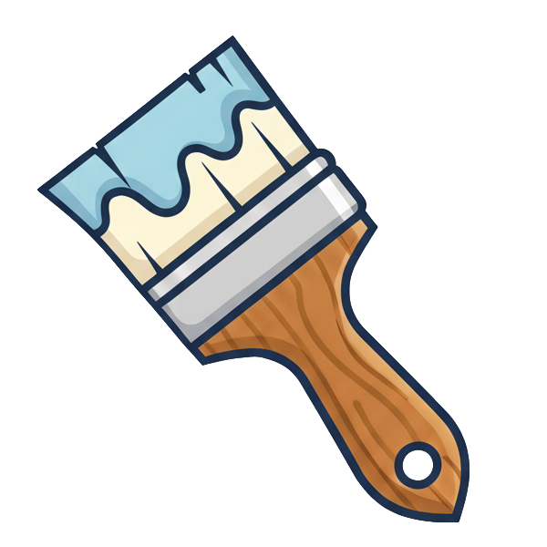

<p align="center"></p>

# Paintbrush

A starter for a website on [Bun](https://bun.sh) that can grow with its requirements. It starts with routes and resources, [railroad](https://github.com/blueshed/railroad) for the page, and [Railway](https://railway.com) for the deploy, and you add the rest when you need it: static files, live documents with [delta](https://github.com/blueshed/delta), SQLite, passwords.

Requires Bun 1.4 or later.

```sh
bun create blueshed/paintbrush myapp
cd myapp
bun dev
```

Open `http://localhost:3000`. You get a message you can edit and save, a status line, and a page that follows a handful of rules written down in `CLAUDE.md`, which is the real documentation: it is what a Claude Code session reads to know what is here, what not to use, and what to add when.

## What's in the box

```
src/
  server.ts       startServer(): the page, one route per resource, /health
  main.ts         the entry point: a pid file, so a server started in the background can be stopped
  index.html      the page; Bun bundles the TypeScript and CSS it references
  app.tsx         the client's hash routes
  resources/      one folder per resource: <name>-api.ts, <name>.ts, <name>-view.tsx
tests/            API, browser (Bun.WebView), entry-point and production-build tests
.railway/         the deploy, as code
```

A **resource** has a server half (`<name>-api.ts`: the type both sides share and plain handlers that return a `Response`), a client store (`<name>.ts`: a signal and `fetch` wrappers) and a view (`<name>-view.tsx`). A **route** is two entries: the server's in `startServer` and the page's in `app.tsx`.

## The rules it keeps

- **Start small.** The core is all there is until something asks for more; each part brings its tests with it, and `bun test` fails below 100% coverage.
- **Bun's built-ins throughout.** No Vite, Express, `ws`, bcrypt or SQLite packages; the page is bundled from an HTML import and tested in a real browser.
- **A server you can stop.** `bun run stop` works because `main.ts` keeps a pid file.
- **Deploy in the box.** `bun run build`, a `/health` route and `.railway/railway.ts` (with a volume for the data). `railway config plan` shows what would change; nothing is applied without you.

## Add when needed

Static files · WebSocket · live documents with delta · SQLite · passwords. Each is a section in `CLAUDE.md` with its code and its tests.

## Starting a project from it

`bun create` runs `create/setup.ts` after installing: it gives the new app a fresh `todo.jsonl` (the ledger of open work) and `CHANGELOG.md`, puts the app's name in place of "Paintbrush", and copies railroad's skills into `.claude/skills`.

## License

MIT
